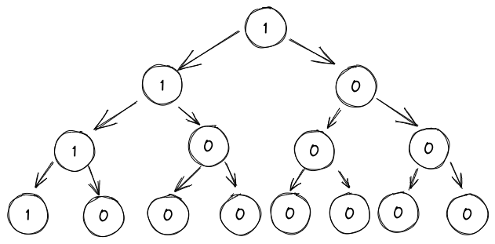

# 前言

第一章的时候大概讲了 `Angr` 的一些基本概念和使用，我思量着应该要弄点实际的东西来练练才能把这个工具用熟捻。

最经典的使用案例无疑是 `angr_ctf` 中的那些了：

> https://github.com/jakespringer/angr_ctf

题目本身都不是很难，甚至大多都是能靠人力完成的工作。但是即便如此，自动化也有自动化的意义对不对。毕竟我们现在需要的不是马上就能用它解决各种难题，而是把简单的问题解决，然后才能开始做复杂问题。

> 附件使用的是 https://github.com/ZERO-A-ONE/AngrCTF_FITM 仓库下编译好的版本。因为原仓库下只有源代码，而且编译还需要另外去配环境，所以这里直接用了这位师傅编译好的附件。

# 实战

一般的基本流程如下：

- 创建项目：angr.Project("./binary")
- 创建 state：project.factory.entry_state()
- 创建 SM：project.factory.simgr(state)
- 探索路径：sim.explore(find=addr)
- 给出结果：sim.found

## 00_angr_find

当然还是得从最简单的开始，题目本身是一个直接用 IDA 读就能读明白的简单程序，但出于练习目的，还是得手写一下脚本。

```c
int __cdecl main(int argc, const char **argv, const char **envp)
{
  int i; // [esp+1Ch] [ebp-1Ch]
  char v5[9]; // [esp+23h] [ebp-15h] BYREF
  unsigned int v6; // [esp+2Ch] [ebp-Ch]

  v6 = __readgsdword(0x14u);
  printf("Enter the password: ");
  __isoc99_scanf("%8s", v5);
  for ( i = 0; i <= 7; ++i )
    v5[i] = complex_function(v5[i], i);
  if ( !strcmp(v5, "JACEJGCS") )
    puts("Good Job.");
  else
    puts("Try again.");
  return 0;
}
```


首先需要创建项目：

```python
import angr
project=angr.Project("./00_angr_find",auto_load_libs=False)
```

创建 state：

```python
state=project.factory.entry_state()
```

创建 SM：

```python
sim=project.factory.simgr(state)
```

搜索路径：

探索路径时需要给出需要查找到的路径地址，这里我们通过 IDA 可以确定程序输出 “Good Job.” 时的地址为 `0x08048675`

```python
sim.explore(find=0x08048675)
```

求解结果：

```python
if sim.found:
	res=sim.found[0]
	res=res.posix.dumps(0)
	print(res)
```

简单说明一下代码。

-  `sim.found[0]` 代表了探索路径时得到的一条可解的路径。
-  `res.posix.dumps(0)` 表示去获取对应路径中，`stdin` 的内容。

## 01_angr_avoid

程序本身很大，IDA 虽然也有办法反编译，但是速度极慢，但用 `Angr` 设定好参数就很快了。

前几个步骤是一样的：

```python
import angr
project=angr.Project("./01_angr_avoid",auto_load_libs=False)
state=project.factory.entry_state()
sim=project.factory.simgr(state)
```

我们不妨试试，如果按照上一题的做法会如何：

```python
sim.explore(find=0x080485E0)
if sim.found:
	res=sim.found[0]
	res=res.posix.dumps(0)
	print(res)
```

结果会发现等了很久也没有算出结果，因为分支实在太多了。

因此要对代码做一点改进：

```python
#080485E0                 push    offset aGoodJob ; "Good Job."

# .text:080485A8 push ebp
# .text:080485A9 mov ebp, esp
# .text:080485AB mov should_succeed, 0
# .text:080485B2 nop
# .text:080485B3 pop ebp
# .text:080485B4 retn
sim.explore(find=0x080485E0,avoid=0x080485A8)
```

其实只是给 `explore` 增加了一个 `avoid` 的参数。当代码模拟执行遇到了该地址时，将会把这段路径放入到 `avoided` 的一个列表中，用来表示被避开的路径，然后其他照旧，继续执行。

之所以通过添加这样的操作就能够得到答案，其实很简单，是为了避免路径爆炸而必要的。

我们可以用这么一个二插树来表示路径：



我们用 `1` 来表示正确的路径，`0` 表示错误的路径。可以看见，在这个树中一共有 8 条不同的路径，而正确的路径只有一个。

假设所有涉及到 `0` 的路径都会进入到某个地址 `x` 处。那么如果没有使用 `avoid` 参数，`Angr` 就会遍历这 8 条路径，然后求解出最左的那条路径所需的输入。

而如果我们添加了 `avoid=x` ，那么当 `Angr` 从根节点进入到右子树时，由于接下来立刻进入到 `x` 地址处，因此停止分析这条路径，将其加入到 `avoided` 中，从而将下面的 4 条路径全都舍弃，将所需的时间直接减少了一半。

同理，当它进入左子树时，仍然存在分叉，而进入右子树的分叉会因为相同的原因被舍弃，从而再次减少一半的时间。

在路径极其庞大的情况下，比如说 2^31 条路径，通过这种方法能够极大程度降低消耗。

## 02_angr_find_condition

```c
int __cdecl main(int argc, const char **argv, const char **envp)
{
  int i; // [esp+18h] [ebp-40h]
  int j; // [esp+1Ch] [ebp-3Ch]
  char v6[20]; // [esp+24h] [ebp-34h] BYREF
  char v7[20]; // [esp+38h] [ebp-20h] BYREF
  unsigned int v8; // [esp+4Ch] [ebp-Ch]

  v8 = __readgsdword(0x14u);
  for ( i = 0; i <= 19; ++i )
    v7[i] = 0;
  qmemcpy(v7, "VXRRJEUR", 8);
  printf("Enter the password: ");
  __isoc99_scanf("%8s", v6);
  for ( j = 0; j <= 7; ++j )
    v6[j] = complex_function(v6[j], j + 8);
  if ( !strcmp(v6, v7) )
    puts("Good Job.");
  else
    puts("Try again.");
  return 0;
}
```

还是这个模板：

```python
import angr
project=angr.Project("./02_angr_find_condition",auto_load_libs=False)
state=project.factory.entry_state()
sim=project.factory.simgr(state)
```

这题的情况和 `00_angr_find` 有些不太一样。尽管 IDA 将它们反编译后的结果看起来很像，但是在汇编中却有很大差别：

![[02condition.png]]

可以看见，这行输出在 `main` 函数里到处都是，所以其实很难找到真正的那条路径的地址。

同理的，“Try again.” 也一样，因此需要修改 `find` 参数：

```python
def succ(state):
	res=state.posix.dumps(1)
	if b"Good Job." in res:
		return True
	else:
		return False

sim.explore(find=succ)
```

可以发现，`find` 参数除了能是一个具体的地址外，还可以是一个函数。该函数返回 `True` 时会将路径记录下来，返回 `False` 时则表示路径并非我们想找的。

而区别路径的关键在于 `state.posix.dumps(1)` ，通过该方法，可以将 `stdout` 中的内容 dump 出来进行比较。如果输出包含了 `Good Job.` ，我们就认为是想要的路径。这样就能避开直接使用地址了。

当然了，`avoid` 也可以这么用，读者可以自行试试。

## 03_angr_simbolic_registers

```c
int __cdecl main(int argc, const char **argv, const char **envp)
{
  int v3; // ebx
  int v4; // eax
  int v5; // edx
  int v6; // ST1C_4
  unsigned int v7; // ST14_4
  unsigned int v9; // [esp+8h] [ebp-10h]
  unsigned int v10; // [esp+Ch] [ebp-Ch]

  printf("Enter the password: ");
  v4 = get_user_input();
  v6 = v5;
  v7 = complex_function_1(v4);
  v9 = complex_function_2(v3);
  v10 = complex_function_3(v6);
  if ( v7 || v9 || v10 )
    puts("Try again.");
  else
    puts("Good Job.");
  return 0;
}
```

还是老三样：

```python
import angr
project=angr.Project("./03_angr_symbolic_registers",auto_load_libs=False)
state=project.factory.entry_state()
sim=project.factory.simgr(state)
```

有些特殊的地方是，输入使用 `get_user_input` ，而该函数如下：

```c
int get_user_input()
{
  int v1; // [esp+0h] [ebp-18h]
  int v2; // [esp+4h] [ebp-14h]
  int v3; // [esp+8h] [ebp-10h]
  unsigned int v4; // [esp+Ch] [ebp-Ch]

  v4 = __readgsdword(0x14u);
  __isoc99_scanf("%x %x %x", &v1, &v2, &v3);
  return v1;
}
```

前文曾提到过，`Angr` 对 `scanf` 这类使用格式化字符串的函数支持并不是很好，不过或许是最近的版本更新，直接这样写也同样能得到结果了：

```python
sim.explore(find=0x80489E9)
if sim.found:
	res=sim.found[0]
	res=res.posix.dumps(0)
	print(res)# b'b9ffd04e ccf63fe8 8fd4d959'
else:
	print("No")
```

不过既然是学习，还是照例看看最标准的写法应该是什么吧。

根据汇编可以看到，该函数的实际操作是将值储存在寄存器中：

```c
.text:0804891E                 lea     ecx, [ebp+var_10]
.text:08048921                 push    ecx
.text:08048922                 lea     ecx, [ebp+var_14]
.text:08048925                 push    ecx
.text:08048926                 lea     ecx, [ebp+var_18]
.text:08048929                 push    ecx
.text:0804892A                 push    offset aXXX     ; "%x %x %x"
.text:0804892F                 call    ___isoc99_scanf
.text:08048934                 add     esp, 10h
.text:08048937                 mov     ecx, [ebp+var_18]
.text:0804893A                 mov     eax, ecx
.text:0804893C                 mov     ecx, [ebp+var_14]
.text:0804893F                 mov     ebx, ecx
.text:08048941                 mov     ecx, [ebp+var_10]
.text:08048944                 mov     edx, ecx
```

因此我们可以直接将该函数钩取，然后手动设置寄存器的值：

```python
import angr
project=angr.Project("./03_angr_symbolic_registers",auto_load_libs=False)
state=project.factory.blank_state(addr=0x08048980)
```

由于现在我们再从 `entry_point` 进入了，而需要跳过 `get_user_input` 函数，因此使用 `blank_state` 来初始化状态，并将开始地址设定在该函数之后的第一条指令处。

接下来创建三个位置的符号向量，将他们设定为寄存器：

```python
import claripy
input1=claripy.BVS("input1",32)
input2=claripy.BVS("input2",32)
input3=claripy.BVS("input3",32)
state.regs.eax=input1
state.regs.ebx=input2
state.regs.edx=input3
sim=project.factory.simgr(state)
sim.explore(find=0x80489E9)
```

此处引入另外一个 `claripy` 包来创建符号向量： `claripy.BVS(name,size)` 。创建完成后即可生成 SM 并开始探索了。

完成探索后，最后需要求解符号向量的值：

```python
if sim.found:
    res=sim.found[0]
    res1=res.solver.eval(input1)
    res2=res.solver.eval(input2)
    res3=res.solver.eval(input3)
    print(hex(res1)+" "+hex(res2)+" "+hex(res3))#0xb9ffd04e 0xccf63fe8 0x8fd4d959
else:
    print("No")
```


## 04_angr_symbolic_stack

```c
int handle_user()
{
  int v1; // [esp+8h] [ebp-10h] BYREF
  int v2[3]; // [esp+Ch] [ebp-Ch] BYREF

  __isoc99_scanf("%u %u", v2, &v1);
  v2[0] = complex_function0(v2[0]);
  v1 = complex_function1(v1);
  if ( v2[0] == 1999643857 && v1 == -1136455217 )
    return puts("Good Job.");
  else
    return puts("Try again.");
}
```


到这一步其实就差不多轻车熟路一把梭搞定了：

```python
import angr
project=angr.Project("./04_angr_symbolic_stack",auto_load_libs=False)
state=project.factory.entry_state()
sim=project.factory.simgr(state)
sim.explore(find=0x080486E4)
if sim.found:
    res=sim.found[0]
    res=res.posix.dumps(0)
    print(res)#b'1704280884 2382341151'
```

不过这道题实际上和上一题类似，但输入值储存在栈中，因此标准做法其实是将内存符号化进行求解：

```python
import angr
project=angr.Project("./04_angr_symbolic_stack",auto_load_libs=False)
state=project.factory.blank_state(addr=0x08048694)

import claripy
input1=claripy.BVS("input1",32)
input2=claripy.BVS("input2",32)
state.regs.ebp=state.regs.esp
state.regs.esp-=0x1c
state.memory.store(state.regs.ebp-0xc,input1)
state.memory.store(state.regs.ebp-0x10,input2)

sim=project.factory.simgr(state)
sim.explore(find=0x080486E4)
if sim.found:
    res=sim.found[0]
    res=res.solver.eval(input1)
    print(res)
    res=sim.found[0]
    res=res.solver.eval(input2)
    print(res)
```

通过 `state.memory.store(addr,value)` 可以对内存进行符号化，从而在路径发现以后进行求解。

## 05_angr_symbolic_memory

```c
int __cdecl main(int argc, const char **argv, const char **envp)
{
  int i; // [esp+Ch] [ebp-Ch]

  memset(&user_input, 0, 33);
  printf("Enter the password: ");
  __isoc99_scanf("%8s %8s %8s %8s", &user_input, &unk_A1BA1C8, &unk_A1BA1D0, &unk_A1BA1D8);
  for ( i = 0; i <= 31; ++i )
    *(i + 169583040) = complex_function(*(i + 169583040), i);
  if ( !strncmp(&user_input, "NJPURZPCDYEAXCSJZJMPSOMBFDDLHBVN", 32) )
    puts("Good Job.");
  else
    puts("Try again.");
  return 0;
}
```

这道题同样因为现在的 `Angr` 功能强大而不需要以前那样复杂的技巧了：

```python
import angr
project=angr.Project("./05_angr_symbolic_memory",auto_load_libs=False)
state=project.factory.entry_state()
sim=project.factory.simgr(state)
sim.explore(find=0x0804866D)

if sim.found:
    res=sim.found[0]
    print(res.posix.dumps(0))#b'NAXTHGNR JVSFTPWE LMGAUHWC XMDCPALU'
```

而题目的本意是让我们将内存符号化，其实和上一题一样，直接对内存进行存储就行了：

```python
import angr
project=angr.Project("./05_angr_symbolic_memory",auto_load_libs=False)
state=project.factory.blank_state(addr=0x080485FE)

import claripy
pwd1=claripy.BVS("pwd1",64)
pwd2=claripy.BVS("pwd2",64)
pwd3=claripy.BVS("pwd3",64)
pwd4=claripy.BVS("pwd4",64)
state.memory.store(0x0A1BA1C0,pwd1)
state.memory.store(0x0A1BA1C0+8,pwd2)
state.memory.store(0x0A1BA1C0+8+8,pwd3)
state.memory.store(0x0A1BA1C0+8+8+8,pwd4)

sim=project.factory.simgr(state)
sim.explore(find=0x0804866D)

if sim.found:
    res=sim.found[0]
    print(res.solver.eval(pwd1))
    print(res.solver.eval(pwd2))
    print(res.solver.eval(pwd3))
    print(res.solver.eval(pwd4))
```

## 06_angr_symbolic_dynamic_memory

```c
int __cdecl main(int argc, const char **argv, const char **envp)
{
  _BYTE *v3; // ebx
  _BYTE *v4; // ebx
  int v6; // [esp-18h] [ebp-24h]
  int v7; // [esp-14h] [ebp-20h]
  int v8; // [esp-10h] [ebp-1Ch]
  int v9; // [esp-8h] [ebp-14h]
  int v10; // [esp-4h] [ebp-10h]
  int v11; // [esp+0h] [ebp-Ch]
  int i; // [esp+0h] [ebp-Ch]

  buffer0 = malloc(9, v6, v7, v8);
  buffer1 = malloc(9, v9, v10, v11);
  memset(buffer0, 0, 9);
  memset(buffer1, 0, 9);
  printf("Enter the password: ");
  __isoc99_scanf("%8s %8s", buffer0, buffer1);
  for ( i = 0; i <= 7; ++i )
  {
    v3 = (_BYTE *)(buffer0 + i);
    *v3 = complex_function(*(char *)(buffer0 + i), i);
    v4 = (_BYTE *)(buffer1 + i);
    *v4 = complex_function(*(char *)(buffer1 + i), i + 32);
  }
  if ( !strncmp(buffer0, "UODXLZBI", 8) && !strncmp(buffer1, "UAORRAYF", 8) )
    puts("Good Job.");
  else
    puts("Try again.");
  free(buffer0);
  free(buffer1);
  return 0;
}
```

和上一题不同的地方在于，这次的存储位置为堆内存，我们不能直接给出一个地址然后去存储。

一把梭还是可行的：

```python
import angr
project=angr.Project("./06_angr_symbolic_dynamic_memory",auto_load_libs=False)
state=project.factory.entry_state()
sim=project.factory.simgr(state)
sim.explore(find=0x08048759)
if sim.found:
    res=sim.found[0]
    print(res.posix.dumps(0))
```

而标准做法是：

```python
import angr
project=angr.Project("./06_angr_symbolic_dynamic_memory",auto_load_libs=False)
state=project.factory.blank_state(addr=0x08048699)
buff0=0x0ABCC8A4
buff1=0x0ABCC8AC

import claripy
pwd1=claripy.BVS("pwd1",64)
pwd2=claripy.BVS("pwd2",64)

state.memory.store(buff0,0xffffff00,endness=project.arch.memory_endness)
state.memory.store(buff1,0xffffff80,endness=project.arch.memory_endness)

state.memory.store(0xffffff00,pwd1)
state.memory.store(0xffffff80,pwd2)

sim=project.factory.simgr(state)
sim.explore(find=0x08048759)
if sim.found:
    res=sim.found[0]
    print(res.solver.eval(pwd1))
    print(res.solver.eval(pwd2))
```

通过这题就能够理解符号执行的一个好处了。由于它并不是真的去执行，只是模拟执行代码而已，所以对地址本身没有限制，完全可以随意设定内存的使用方法。

另外 `endness` 参数用于指定储存的端序，而 `project.arch.memory_endness` 将会反映程序所在平台的默认端序，此处为小端序。

## 07_angr_symbolic_file

```c
int __cdecl main(int argc, const char **argv, const char **envp)
{
  int result; // eax
  int i; // [esp+Ch] [ebp-Ch]

  memset(&buffer, 0, 64);
  printf("Enter the password: ");
  __isoc99_scanf("%64s", &buffer);
  ignore_me(&buffer, 64);
  memset(&buffer, 0, 64);
  fp = fopen("OJKSQYDP.txt", "rb");
  fread(&buffer, 1, 64, fp);
  fclose(fp);
  unlink("OJKSQYDP.txt");
  for ( i = 0; i <= 7; ++i )
    *(_BYTE *)(i + 134520992) = complex_function(*(char *)(i + 134520992), i);
  if ( strncmp(&buffer, "AQWLCTXB", 9) )
  {
    puts("Try again.");
    exit(1);
  }
  puts("Good Job.");
  exit(0);
  _libc_csu_init();
  return result;
}
```

可以发现程序调用了 `fopen` 去打开文件，对于这种情况，`Angr` 也同样提供了模拟文件的系统。

同样的，照旧一把梭也能搞定：

```python
import angr
project=angr.Project("./07_angr_symbolic_file",auto_load_libs=False)
state=project.factory.entry_state()
sim=project.factory.simgr(state)
sim.explore(find=0x080489B0)
if sim.found:
    res=sim.found[0]
    print(res.posix.dumps(0))
#b'AZOMMMZM\x00@\x04\x00\x01\x01\x01\x01\x01\x00\x00\x00\x02\x00\x01\x00\x80\x04\x80\x00\x02\x01\x04\x00\x02\x80\x08\x01\x00\x02\x01\x01\x01@\x01\x00\x08\x08\x04\x80\x04\x01\x80\x01\x04\x80\x02\x00\x00@\x00\x00\x00\x00\x00\x00'
```

不过还是来看看它的模拟文件系统吧：

```python
import angr
import claripy
project=angr.Project("./07_angr_symbolic_file",auto_load_libs=False)
state=project.factory.blank_state(addr=0x080488EA)
filename = 'OJKSQYDP.txt'
pwd1=claripy.BVS("pwd1",64*8)

pwdfile=angr.storage.SimFile(filename,content=pwd1,size=64)
state.fs.insert(filename,pwdfile)

sim=project.factory.simgr(state)
sim.explore(find=0x080489B0)
if sim.found:
    res=sim.found[0]
    print(hex(res.solver.eval(pwd1)))
    
#0x415a4f4d4d4d5a4d0000000000000000000000000002000020000000000200000000000000008000000000401002000000000000000000000004001000000000
```

前几个还是照旧，但是也有一些新东西：

```python
pwdfile=angr.storage.SimFile(filename,content=pwd1,size=64)
state.fs.insert(filename,pwdfile)
```

`angr.storage.SimFile` 提供了一个模拟文件系统，通过 `state.fs.insert` 可以将该模拟出来的文件插入到 `state` 符号中。这样在模拟执行时就会用该文件替代真实情况下的文件了。

而 `angr.storage.SimFile` 的 `filename` 参数表示文件名，`content` 参数表示文件内容，`size` 参数表示文件大小，单位为字节。

## 08_angr_constraints

```c
int __cdecl main(int argc, const char **argv, const char **envp)
{
  int i; // [esp+Ch] [ebp-Ch]

  qmemcpy(&password, "AUPDNNPROEZRJWKB", 16);
  memset(&buffer, 0, 17);
  printf("Enter the password: ");
  __isoc99_scanf("%16s", &buffer);
  for ( i = 0; i <= 15; ++i )
    *(i + 134520912) = complex_function(*(i + 134520912), 15 - i);
  if ( check_equals_AUPDNNPROEZRJWKB(&buffer, 16) )
    puts("Good Job.");
  else
    puts("Try again.");
  return 0;
}
```

```c
BOOL __cdecl check_equals_AUPDNNPROEZRJWKB(int a1, unsigned int a2)
{
  int v3; // [esp+8h] [ebp-8h]
  unsigned int i; // [esp+Ch] [ebp-4h]

  v3 = 0;
  for ( i = 0; i < a2; ++i )
  {
    if ( *(i + a1) == *(i + 134520896) )
      ++v3;
  }
  return v3 == a2;
}
```

在这里就能遇到之前所说的 “路径爆炸” 问题了。

照例试试一把梭：

```python
import angr
project=angr.Project("./08_angr_constraints",auto_load_libs=False)
state=project.factory.entry_state()
sim=project.factory.simgr(state)
sim.explore(find=0x08048694)
if sim.found:
    print("yes")
```

会发现这次就没办法那么顺利得到答案了，`Angr` 求解了半天却一直没有给出 “yes” 的回答，因此这次我们必须手动去优化求解的过程。

分析 `check_equals_AUPDNNPROEZRJWKB` 函数可以发现，该函数实际上是在对输入和 `password` 对比，而 `password` 的值是固定的 `AUPDNNPROEZRJWKB` 。

因此第一种缓解路径爆炸的方法是，只需要探索到进入该路径即可。而此后的求解过程通过人为的方法手动增加。

首先还是创建状态，这里我们跳过了 `scanf` ：

```python
import angr
project=angr.Project("./08_angr_constraints",auto_load_libs=False)
state=project.factory.blank_state(addr=0x08048625)
```

接下来我们为 `buffer` 创建符号，并开始探索：

```python
import claripy
pwd=claripy.BVS("pwd",16*8)
state.memory.store(0x0804A050,pwd)

sim=project.factory.simgr(state)
sim.explore(find=0x08048565)
```

此处地址 `0x08048565` 对应了 `check_equals_AUPDNNPROEZRJWKB` 函数的第一行指令。这样就不必进入到会引发路径爆炸的循环中了。

最后，在找到路径以后，为求解器主动添加条件：

```python
if sim.found:
    res=sim.found[0]
    now_str=state.memory.load(0x0804A050,16)
    res.solver.add("AUPDNNPROEZRJWKB"==now_str)
    print(res.solver.eval(pwd)) 
```

我们需要保证的是，在进入 `check_equals_AUPDNNPROEZRJWKB` 函数时，`buffer` 处的内容和字符串 `AUPDNNPROEZRJWKB` 相同，因此直接添加条件即可求解。

## 09_angr_hooks

```c
int __cdecl main(int argc, const char **argv, const char **envp)
{
  BOOL v3; // eax
  int i; // [esp+8h] [ebp-10h]
  int j; // [esp+Ch] [ebp-Ch]

  qmemcpy(&password, "XYMKBKUHNIQYNQXE", 16);
  memset(&buffer, 0, 17);
  printf("Enter the password: ");
  __isoc99_scanf("%16s", &buffer);
  for ( i = 0; i <= 15; ++i )
    *(_BYTE *)(i + 134520916) = complex_function(*(char *)(i + 134520916), 18 - i);
  equals = check_equals_XYMKBKUHNIQYNQXE(&buffer, 16);
  for ( j = 0; j <= 15; ++j )
    *(_BYTE *)(j + 134520900) = complex_function(*(char *)(j + 134520900), j + 9);
  __isoc99_scanf("%16s", &buffer);
  v3 = equals && !strncmp(&buffer, &password, 16);
  equals = v3;
  if ( v3 )
    puts("Good Job.");
  else
    puts("Try again.");
  return 0;
}
```

而上一题的操作总归来说是解一时之急，因为函数正好在最后的位置，所以停在那边就足够了。但是如果路径爆炸发生在中途，就不能这么做了，我们需要更好的方法解决它。

首先是路径爆炸会发生在 `check_equals_XYMKBKUHNIQYNQXE` 函数中，它和上一题的函数是一样的。

前几个还是一样：

```python
import angr
import claripy
project=angr.Project("./09_angr_hooks",auto_load_libs=False)
state=project.factory.entry_state()
```

接下来是对该函数进行钩取：

```python
@project.hook(0x080486B3, length=5)
def skip_check(state):
    compare_str="XYMKBKUHNIQYNQXE"
    now_str=state.memory.load(0x0804A054,16)
    state.regs.eax=claripy.If(compare_str==now_str,claripy.BVV(1, 32),claripy.BVV(0, 32))
```

钩取方法可以通过 `@project.hook` 宏完成。第一个参数为对应的机器码地址，第二个参数为钩取的指令长度。此处因为我们只需要钩取 `call` 指令，因此长度为 5。

而钩子下面对应的需要定义钩子函数，此处我们将 `buffer` 的内容读取出来进行比较，并根据结果使用 `claripy.If` 来设置 eax 寄存器。

最后探索路径即可：

```python
sim=project.factory.simgr(state)
sim.explore(find=0x08048768)

if sim.found:
    res=sim.found[0]
    print(res.posix.dumps(0))
```

此方法为第二个缓解路径爆炸的方法，即直接对地址进行钩取。

## 10_angr_simprocedures

```c
int __cdecl main(int argc, const char **argv, const char **envp)
{
  int i; // [esp+20h] [ebp-28h]
  char v5[17]; // [esp+2Bh] [ebp-1Dh] BYREF
  unsigned int v6; // [esp+3Ch] [ebp-Ch]

  v6 = __readgsdword(0x14u);
  memcpy(&password, "ORSDDWXHZURJRBDH", 16);
  memset(v5, 0, sizeof(v5));
  printf("Enter the password: ");
  __isoc99_scanf("%16s", v5);
  for ( i = 0; i <= 15; ++i )
    v5[i] = complex_function(v5[i], 18 - i);
  if ( check_equals_ORSDDWXHZURJRBDH(v5, 16) )
    puts("Good Job.");
  else
    puts("Try again.");
  return 0;
}
```

第 10 题看起来和上一题一样，但是还是那个问题，如果调用点很多该怎么办？虽然 IDA 分析出的结果相似，但是通过交叉引用可以发现：

![[10sim.png]]

显然不太可能每次都对地址进行钩取，因此需要有一个方法直接钩取函数：

```python
import angr
import claripy
project=angr.Project("./10_angr_simprocedures",auto_load_libs=False)
state=project.factory.entry_state()
```

接下来钩取函数：

```python
class ReplaceCmp(angr.SimProcedure):
    def run(self,arg1,arg2):
        cmp_str="ORSDDWXHZURJRBDH"
        input_str=self.state.memory.load(arg1,arg2)
        return claripy.If(cmp_str==input_str,claripy.BVV(1,32),claripy.BVV(0,32))

project.hook_symbol("check_equals_ORSDDWXHZURJRBDH", ReplaceCmp())
```

首先需要声明一个类，并定义 `run` 方法，而该方法将取代想要钩取的函数。其参数会和钩取的函数有相同的参数列表，但除此之外还需要一个 `self` 。

至于 `run` 函数的实现则各不相同了。这里我们就直接模仿比较函数的最终效果，返回比较的结果。

然后调用 `project.hook_symbol` 方法直接以函数名为参数对函数进行钩取即可。

## 11_angr_sim_scanf

```c
int __cdecl main(int argc, const char **argv, const char **envp)
{
  int i; // [esp+20h] [ebp-28h]
  char v6[20]; // [esp+28h] [ebp-20h] BYREF
  unsigned int v7; // [esp+3Ch] [ebp-Ch]

  v7 = __readgsdword(0x14u);
  print_msg();
  memset(v6, 0, sizeof(v6));
  qmemcpy(v6, "DCLUESMR", 8);
  for ( i = 0; i <= 7; ++i )
    v6[i] = complex_function(v6[i], i);
  printf("Enter the password: ");
  __isoc99_scanf("%u %u", &buffer0, &buffer1);
  if ( !strncmp(&buffer0, v6, 4) && !strncmp(&buffer1, &v6[4], 4) )
    puts("Good Job.");
  else
    puts("Try again.");
  return 0;
}
```

发现一把梭能解决：

```python
import angr
project=angr.Project("./11_angr_sim_scanf",auto_load_libs=False)
state=project.factory.entry_state()
sim=project.factory.simgr(state)
sim.explore(find=0x0804FCA1)
if sim.found:
    res=sim.found[0]
    print(res.posix.dumps(0))
    #b'1146242628 1296386129'
```

不过原题的目的是让我们去钩取 `scanf` 函数。其实做法和上一题一样，这里就不再重复了。不过有一点我们必须抱有疑问，我们知道这类函数的参数数量是不确定的，但如果想要钩取一个函数，我们就需要给定一个确定的参数列表，这样才能定义 `run` 方法。

这个问题我们留待以后阅读源代码再做考虑。至少目前来看，`Angr` 已经完善了 `scanf` 函数的 hook 了，我们可以直接一把梭解决这个问题。

## 12_angr_veritesting

```c
// bad sp value at call has been detected, the output may be wrong!
int __cdecl main(int argc, const char **argv, const char **envp)
{
  int v3; // ebx
  int v5; // [esp-10h] [ebp-5Ch]
  int v6; // [esp-Ch] [ebp-58h]
  int v7; // [esp-8h] [ebp-54h]
  int v8; // [esp-4h] [ebp-50h]
  const char **v9; // [esp+0h] [ebp-4Ch]
  int v10; // [esp+4h] [ebp-48h]
  int v11; // [esp+8h] [ebp-44h]
  int v12; // [esp+Ch] [ebp-40h]
  int v13; // [esp+10h] [ebp-3Ch]
  int v14; // [esp+10h] [ebp-3Ch]
  int v15; // [esp+14h] [ebp-38h]
  int i; // [esp+14h] [ebp-38h]
  int v17; // [esp+18h] [ebp-34h]
  int v18[9]; // [esp+1Ch] [ebp-30h] BYREF
  unsigned int v19; // [esp+40h] [ebp-Ch]
  int *p_argc; // [esp+44h] [ebp-8h]

  p_argc = &argc;
  v9 = argv;
  v19 = __readgsdword(0x14u);
  print_msg();
  memset(
    v18 + 3,
    0,
    33,
    v5,
    v6,
    v7,
    v8,
    v9,
    v10,
    v11,
    v12,
    v13,
    v15,
    v17,
    v18[0],
    v18[1],
    v18[2],
    v18[3],
    v18[4],
    v18[5]);
  printf("Enter the password: ");
  __isoc99_scanf("%32s", v18 + 3);
  v14 = 0;
  for ( i = 0; i <= 31; ++i )
  {
    v3 = *(v18 + i + 3);
    if ( v3 == complex_function(87, i + 186) )
      ++v14;
  }
  if ( v14 != 32 || v19 )
    puts("Try again.");
  else
    puts("Good Job.");
  return 0;
}
```

既然我们是通过钩取函数来解决某个函数的路径爆炸问题，那么就肯定会遇到这么一种情况：`函数的某部分引发路径爆炸，但其他部分在做必要的运算` 。

本题就可以发现，循环判断语句嵌在 `main` 函数中，我们显然不能直接把整个 `main` 函数 hook 掉，那样就和直接读代码逆向没区别了。

`Angr` 提供了一种名为 `Veritesting` 的算法，它能够让符号执行引起在 `动态符号执行DSE` 和 `静态符号执行SSE` 之间协同工作从而减少路径爆炸的问题。

在 `Angr` 中只需要为 `project.factory.simgr` 添加一个参数 `veritesting=True` 即可开启。

```python
import angr
project=angr.Project("./12_angr_veritesting",auto_load_libs=False)
state=project.factory.entry_state()
sim=project.factory.simgr(state,veritesting=True)

sim.explore(find=0x08048684)
if sim.found:
    res=sim.found[0]
    print(res.posix.dumps(0))
b'CXSNIDYTOJEZUPKFAVQLGBWRMHCXSNID'
```

不过不得不说的是，这个方法看起来好像很万能，其实并没有想象中的那么好用。对于本题的这个体量来说，笔者执行了约 5 次才有一次能够迅速的算出结果。可想而知，对于体积稍微大一些，类似的循环稍微多一些的程序来说，这个方法并不能带来多大的提升，反而会让人难以猜测程序究竟是卡在路径爆炸中还是仍然处于计算。

因此对于一些简单的问题，笔者虽然推荐这个方法，但只要问题稍微复杂一点，它甚至会增加人力负担。

## 13_angr_static_binary

```c
int __cdecl main(int argc, const char **argv, const char **envp)
{
  int i; // [esp+1Ch] [ebp-3Ch]
  int j; // [esp+20h] [ebp-38h]
  char v6[20]; // [esp+24h] [ebp-34h] BYREF
  char v7[20]; // [esp+38h] [ebp-20h] BYREF
  unsigned int v8; // [esp+4Ch] [ebp-Ch]

  v8 = __readgsdword(0x14u);
  print_msg();
  for ( i = 0; i <= 19; ++i )
    v7[i] = 0;
  qmemcpy(v7, "LJVNEPAU", 8);
  printf("Enter the password: ");
  _isoc99_scanf("%8s", v6);
  for ( j = 0; j <= 7; ++j )
    v6[j] = complex_function(v6[j], j);
  if ( !strcmp(v6, v7) )
    puts("Good Job.");
  else
    puts("Try again.");
  return 0;
}
```

程序本身也并不复杂，和上一题的主要区别在于，这次使用了静态编译去生成二进制文件。

本身 `Angr` 是在库函数装载时钩取这些函数的，静态编译的程序没有这个过程，因此道理上就会被主动分析，这就会带来很大的消耗了，因此本题需要钩取那些静态编译生成的库函数。

其实差异不大，在上一篇文章中提到过，`angr` 内置了多个库函数，既然现在它无法自动钩取，由我们手动去做这件事就行了：

```python
import angr
project=angr.Project("./13_angr_static_binary",auto_load_libs=False)
state=project.factory.entry_state()

project.hook(0x0804ED40,angr.SIM_PROCEDURES['libc']['printf']())
project.hook(0x0804ED80,angr.SIM_PROCEDURES['libc']['scanf']())
project.hook(0x0804F350,angr.SIM_PROCEDURES['libc']['puts']())
project.hook(0x08048D10,angr.SIM_PROCEDURES['glibc']['__libc_start_main']())
project.hook(0x0805B450,angr.SIM_PROCEDURES['libc']['strcmp']())

sim=project.factory.simgr(state,veritesting=True)
sim.explore(find=0x080489E1)
if sim.found:
    res=sim.found[0]
    print(res.posix.dumps(0))#LYZGMMMV
```

## 14_angr_shared_library

![[14shared.png]]

```c
BOOL __cdecl validate(int a1, int a2)
{
  _BYTE *v3; // esi
  char v4[20]; // [esp+4h] [ebp-24h] BYREF
  int j; // [esp+18h] [ebp-10h]
  int i; // [esp+1Ch] [ebp-Ch]

  if ( a2 <= 7 )
    return 0;
  for ( i = 0; i <= 19; ++i )
    v4[i] = 0;
  qmemcpy(v4, "WLKGLJWH", 8);
  for ( j = 0; j <= 7; ++j )
  {
    v3 = (j + a1);
    *v3 = complex_function(*(j + a1), j);
  }
  return strcmp(a1, v4) == 0;
}
```

这道题的特殊情况在于程序加载了额外的动态库并使用其中的函数。由于这个动态库是用户编写的，`Angr` 不能找到替代品去 hook 。而我们其实也不方便直接加载它，因为通过 `auto_load_libs` 会把其他无关紧要的东西一起加载进来。

不过好在，这道题的主要逻辑全都放在了动态库中，这就能简化我们的操作了。

我们可以使用 `call_state` 来完成操作：

```python
import angr
project=angr.Project("./lib14_angr_shared_library.so",auto_load_libs=False)
state=project.factory.call_state(0x000006D7+0x400000,arg1,claripy.BVV(8, 32))
```

- 参数一：入口点地址
- 参数二：该函数对应的参数 1
- 参数三：该函数对应的参数 2
- ......

另外，我们将该函数的加载基址设到了 `0x400000` 。

然后就是对参数的内容进行符号化：

```python
pwd = claripy.BVS('pwd', 8*8)
state.memory.store(arg1, pwd)
```

最后就是求解方程了：

```python
sim=project.factory.simgr(state)

sim.explore(find=0x783+0x400000)
if sim.found:
    res=sim.found[0]
    res.add_constraints(res.regs.eax!=0)
    print(res.solver.eval(pwd))#6293577405752494919
```

不过因为校验返回值的内容并不在库文件，所以我们需要手动通过 `add_constraints` 来为状态添加约束。

当然，用 `res.solver.add` 也是可以的：

```python
sim.explore(find=0x783+0x400000)
if sim.found:
    res=sim.found[0]
    res.solver.add(res.regs.eax!=0)
    print(res.solver.eval(pwd))#6293577405752494919
```

不过需要区别的是，`add_constraints` 的约束是对状态所做的，而 `res.solver.add` 是对约束器做的。在本题中两个方法都行，但不能混用。

## 15_angr_arbitrary_read

```c
int __cdecl main(int argc, const char **argv, const char **envp)
{
  char v4; // [esp+Ch] [ebp-1Ch] BYREF
  char *v5; // [esp+1Ch] [ebp-Ch]

  v5 = try_again;
  print_msg();
  printf("Enter the password: ");
  __isoc99_scanf("%u %20s", &key, &v4);
  if ( key == 19511649 )
    puts(v5);
  else
    puts(try_again);
  return 0;
}
```

这次的题目就比较特殊了，它要求我们用 `Angr` 自动求解一个 payload，使得最终会溢出到变量 `v5` 来修改 `puts` 的参数。

```python
import angr
project=angr.Project("./15_angr_arbitrary_read",auto_load_libs=False)
state=project.factory.entry_state()
sim=project.factory.simgr(state)

def check_puts(state):
    puts_parameter = state.memory.load(state.regs.esp + 4, 4, endness=project.arch.memory_endness)
    is_vulnerable_expression = puts_parameter == 0x594e4257
    if is_vulnerable_expression!=0:
        return True
    else:
        return False

def is_successful(state):
    puts_address = 0x8048370
    if state.addr == puts_address:
        return check_puts(state)
    else:
        return False

sim.explore(find=is_successful)

if sim.found:
    res=sim.found[0]
    print(res.posix.dumps(0))
```

其实思路很朴素，在函数调用 `pust` 时检查一下参数，看看它是不是 `Good Job` 字符串的地址即可。

不得不说，`Angr` 的功能确实强大，连自动化求解 payload 都能做到了。

## 16_angr_arbitrary_write

```c
int __cdecl main(int argc, const char **argv, const char **envp)
{
  char v4[16]; // [esp+Ch] [ebp-1Ch] BYREF
  void *v5; // [esp+1Ch] [ebp-Ch]

  v5 = &unimportant_buffer;
  memset(v4, 0, sizeof(v4));
  strncpy(&password_buffer, "PASSWORD", 12);
  print_msg();
  printf("Enter the password: ");
  __isoc99_scanf("%u %20s", &key, v4);
  if ( key == 24173502 )
    strncpy(v5, v4, 16);
  else
    strncpy(&unimportant_buffer, v4, 16);
  if ( !strncmp(&password_buffer, "DVTBOGZL", 8) )
    puts("Good Job.");
  else
    puts("Try again.");
  return 0;
}
```

目的是显然的，通过 `__isoc99_scanf` 来溢出，让 `v5` 指向 `password_buffer` 。

笔者本来是打算直接直接将结果卡在 `strncpy` ：

![[16write.png]]

```python
import angr
import claripy
project=angr.Project("./16_angr_arbitrary_write",auto_load_libs=False)
state=project.factory.entry_state()
sim=project.factory.simgr(state)

def is_successful(state):
    if state.addr== 0x08048611:
        return True
    else:
        return False

sim.explore(find=is_successful)

if sim.found:
    print("yes")
    res=sim.found[0]
    print(res.posix.dumps(0))
else:
    print("no")
```

最后会发现这个写法是有问题的，`Angr` 最终会给出 `No` 。可以发现 `Angr` 对 `find` 的判断取决于每次进入基本块的第一个地址。

因为它并不以每一条指令进行判断，而是对每次状态执行一次 `step` 执行完整个基本块后，再调用 `find` 的条件进行判断。

> 不过，如果 `find` 本身是一个地址的话，却能够正常发现，有点奇怪，这个问题留到以后看源代码吧。

最后笔者试着这样去完成：

```python
import angr
import claripy
project=angr.Project("./16_angr_arbitrary_write",auto_load_libs=False)
state=project.factory.entry_state()
sim=project.factory.simgr(state)

def check_v5(state):
    arg0=state.memory.load(state.regs.ebp-0xc,4,endness=project.arch.memory_endness)
    arg1=state.memory.load(state.regs.ebp-0x1c,4,endness=project.arch.memory_endness)
    now_str=state.memory.load(arg1,8)
    if state.solver.symbolic(arg0) and state.solver.symbolic(now_str):
        does_src_hold_password=arg0==0x4655544c
        does_dest_equal_buffer_address=now_str[-1:-64] == 'DVTBOGZL'
        if state.satisfiable(extra_constraints=(does_src_hold_password, does_dest_equal_buffer_address)):
            state.add_constraints(does_src_hold_password,does_dest_equal_buffer_address)
            return True
        else:
            return False
    else:
        return False


def is_successful(state):
    if state.addr== 0x08048604:
        return check_v5(state)
    else:
        return False

sim.explore(find=is_successful)

if sim.found:
    print("yes")
    res=sim.found[0]
    print(res.posix.dumps(0))
else:
    print("no")
```

它能帮我算出 `key` 和 `v4` 的最后四字节，但是中间的前几位却一直算不出结果。如果您知道为什么还请告诉我。

```c
b'0024173502 \xf0\xff\xff\xff\x00\x00\x00\x00\x00\x00\x00\x00\x00\x00\x00\x00LTUF'
```

最后还是修改了钩子钩取的地址来完成本题：

```python
import angr
import claripy
project=angr.Project("./16_angr_arbitrary_write",auto_load_libs=False)
state=project.factory.entry_state()
sim=project.factory.simgr(state)

def check_v5(state):
    arg0=state.memory.load(state.regs.esp + 4,4,endness=project.arch.memory_endness)
    arg1=state.memory.load(state.regs.esp + 8,4,endness=project.arch.memory_endness)
    now_str=state.memory.load(arg1,8)
    if state.solver.symbolic(arg0) and state.solver.symbolic(now_str):
        does_src_hold_password=arg0==0x4655544c
        does_dest_equal_buffer_address=now_str[-1:-64] == 'DVTBOGZL'
        if state.satisfiable(extra_constraints=(does_src_hold_password, does_dest_equal_buffer_address)):
            state.add_constraints(does_src_hold_password,does_dest_equal_buffer_address)
            return True
        else:
            return False
    else:
        return False


def is_successful(state):
    if state.addr== 0x8048410:
        return check_v5(state)
    else:
        return False

sim.explore(find=is_successful)

if sim.found:
    res=sim.found[0]
    print(res.posix.dumps(0))
    #b'0024173502 DVTBOGZL\x00\x00\x00\x00\x00\x00\x00\x00LTUF'
else:
    print("no")
```

可以看见，如果我将判断的地址添加在 `0x8048410` 处，也就是 `strncpy` 的 plt 表上，就能够顺利解决这个问题了。

有些迷惑。

## 17_angr_arbitrary_jump

```c
int __cdecl main(int argc, const char **argv, const char **envp)
{
  print_msg();
  printf("Enter the password: ");
  read_input();
  puts("Try again.");
  return 0;
}
```

```c
int read_input()
{
  char v1[30]; // [esp+1Ah] [ebp-1Eh] BYREF

  return __isoc99_scanf(&unk_4D4C4860, v1);
}
```

> `unk_4D4C4860` 处为 `%s`

显然就是一个栈溢出了，但是这次需有让 `Angr` 自动去覆盖返回地址到 `print_good` 函数：

```c
int print_good()
{
  puts("Good Job.");
  exit(0);
  return read_input();
}
```

同样还是最开始那几个，但是注意，本题需要额外添加一个参数：

```python
import angr
project=angr.Project("./17_angr_arbitrary_jump",auto_load_libs=False)
state=project.factory.entry_state()
sim=project.factory.simgr(state,save_unconstrained=True)
```

`save_unconstrained=True` 会让 `Angr` 保存那些不受约束的状态。其实默认情况下的状态就是未约束的。将这些路径保存下来以后，进行遍历：

```python
d=sim.explore()

for state in d.unconstrained:
    typ=project.arch.memory_endness
    next_stack=state.memory.load(state.regs.esp,4,endness=typ)
    state.add_constraints(next_stack==0x4D4C4749)
    state.add_constraints(state.regs.eip==0x4D4C4785)
    print(state.posix.dumps(0))
#b'\x00\x00\x00\x00\x00\x00\x00\x00\x00\x00\x00\x00\x00\x00\x00\x00\x00\x00\x00\x00\x00\x00\x00\x00\x00\x00\x00\x00\x00\x00\x00\x00\x00\x00\x85GLMIGLM\x00\x00\x00\x00\x00\x00\x00\x00\x00\x00\x00\x00\x00\x00\x00\x00\x00\x00
```

为状态添加约束，去寻找同时满足 `next_stack==0x4D4C4749` 和 `state.regs.eip==0x4D4C4785` 的状态，然后给出该状态对应的 `stdin` 。

# 结语

其实做完这么多题目，尽管感叹 `Angr` 确实厉害的同时，也不得不承认它仍然有很多的问题，也并没有想象中那么完美。或许要让它走向更加实用的方向还需要一定的积累吧。